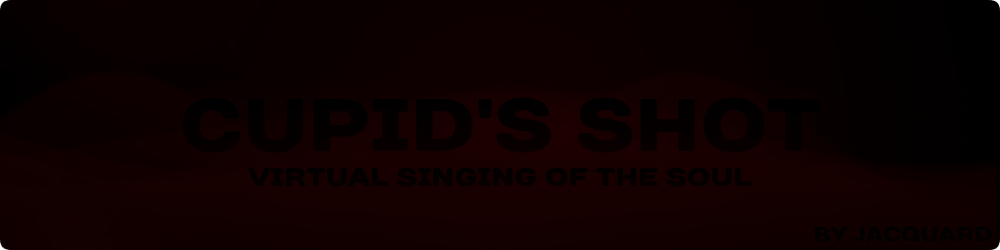
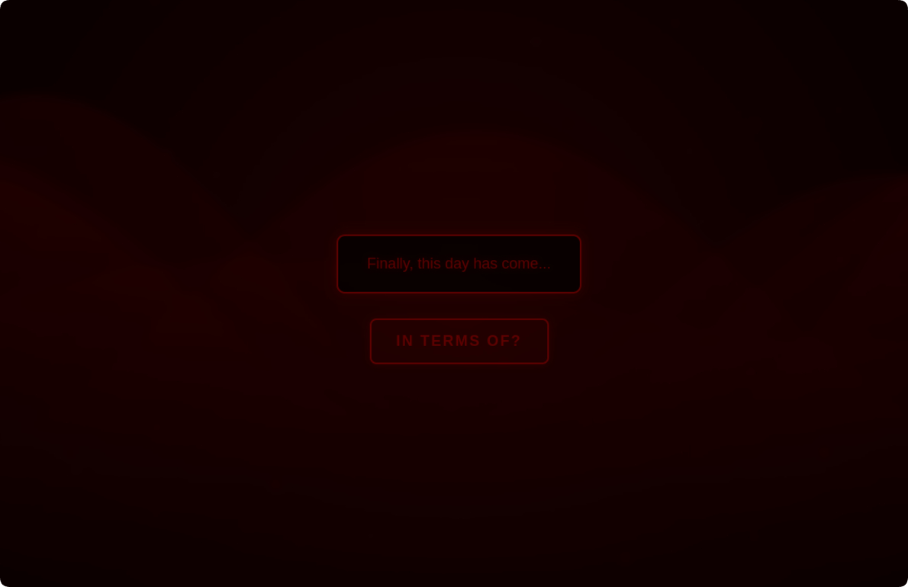

<div align="center">



# Cupid's Shot - An Interactive Love Confession 

**Version: v.0.1A**

[]()
[]()
[]()
[]()
[](LICENSE)

**Cupid's Shot** is a personalized, interactive, and emotionally resonant web experience designed to convey a heartfelt love confession. The project combines a beautiful, animated canvas background with a branching narrative and atmospheric music to create a memorable and impactful single-page application. It's a digital love letter for the modern age.

**[🌐 Visit Project Website](https://declaration-of-love.vercel.app/)**

</div>

---

## 📸 Key Scenes

The experience is a linear progression through several key emotional stages.

<div align="center">
<table>
  <tr>
    <td></td>
    <td></td>
  </tr>
  <tr>
    <td align="center"><em>Fake progress bar</em></td>
    <td align="center"><em>A button that when pressed causes a miracle to happen</em></td>
  </tr>
</table>
</div>

---

## ✨ Key Features

-   **Interactive Narrative**: A story-driven experience that guides the user through a romantic confession.
-   **Branching Paths**: The story's conclusion and background music change based on the user's response, leading to different endings.
-   **Dynamic Animated Background**: A visually stunning background created with the HTML5 Canvas API, featuring pulsating particles, flowing waves, and gentle vortexes in a dark, romantic theme.
-   **Atmospheric Audio**: Includes two separate music tracks that fade in and out to match the emotional tone of the narrative path.
-   **Responsive Design**: The interface is fully responsive and optimized for a seamless experience on desktops, tablets, and mobile devices.
-   **Personalizable**: The core text in `index.html` can be easily edited to personalize the message, including the recipient's name.
-   **Pure Frontend**: Runs entirely in the browser with no server-side dependencies, making it easy to host or share.

---

## 🛠️ Tech Stack

| Category      | Technology                                                                                                  | Description                                                          |
| :------------ | :---------------------------------------------------------------------------------------------------------- | :------------------------------------------------------------------- |
| **Structure**   |                   | The core structure of the single-page application and its narrative content. |
| **Styling**     |                     | Styling, layout, responsive design, and keyframe animations. |
| **Logic**       |        | Powers all interactivity, state management, and DOM manipulation.    |
| **Graphics**    |                                      | Renders the complex, real-time animated background.                |
| **Audio**       |                                       | Manages the playback and smooth fading of background music.          |

---

## 🚀 Getting Started

### Prerequisites

-   A modern web browser (e.g., Chrome, Firefox, Safari, Edge).
-   (Optional) A local web server for development to avoid potential browser restrictions on loading local files (`file:///`).

### Installation and Launch

1.  **Clone the repository:**
    ```bash
    git clone https://github.com/Jacqquard/CupidsShot.git
    cd cupids-shot
    ```

2.  **(Optional) Personalize the message:**
    -   Open `index.html` in a text editor.
    -   Find and replace the placeholder `{girl's name}` with the desired name.
    -   You can also edit the text within the `<p>` tags to customize the confession.

3.  **Open the application:**
    -   Simply open the `index.html` file in your web browser.
    -   For the best experience without browser security issues (especially for audio), run it from a local server. If you have Python, you can run:
      ```bash
      # For Python 3
      python -m http.server
      ```
      Then, navigate to `http://localhost:8000` in your browser.

---

## 📁 Project Structure

```
Cupid's Shot/
│
├── index.html         # The main file: structure, text content, and narrative slides.
├── script.js          # Core logic: slide transitions, canvas animation, and audio management.
├── style.css          # All styles: layout, theme, animations, and responsive design.
│
├── img/
│   ├── heart.png      # Animated heart icon used in the loader screen.
│   └── location.png   # img displayed in the positive outcome of the story.
│
└── music/
    ├── music.mp3      # The main, uplifting background music track.
    └── music1.mp3     # The alternative, melancholic music for the other ending.
```

---

## 🔬 Detailed Code Breakdown

### `index.html` (The Narrative Skeleton)

This file defines the entire structure of the experience. It is not a traditional webpage, but a series of "slides" that are shown or hidden by JavaScript.

-   **Loader Screen**: The initial screen (`#loader`) with a beating heart animation that hides the page while assets load.
-   **Canvas & Frosted Glass**: The `<canvas>` element for the background animation and a `<div>` for a `backdrop-filter` effect.
-   **Slides (`.slide`)**: Each slide is a `div` representing a step in the story. They contain a message box (`.message-box`) and buttons (`.fancy-button`).
-   **Branching Logic**: The structure includes separate slides for the different outcomes:
    -   `#slide-7-yes` and `#slide-8-yes` for the positive path.
    -   `#slide-7-no` and `#slide-8-no-yes` for the negative path.
-   **Assets**: Contains `<audio>` tags to declare the music sources and `` tags for imgs used in the story.

### `script.js` (The Heartbeat of the App)

This file contains all the client-side logic that brings the story to life.

-   **Canvas Animation**: The top section of the script is dedicated to the background.
    -   It initializes a canvas context and populates arrays of `particles`, `waves`, and `vortexes` with random properties.
    -   The `animate()` function runs on a `requestAnimationFrame` loop, continuously redrawing the canvas. It calculates the position and appearance of each element based on time, creating a living, dynamic visual.
-   **State Management**: Simple variables like `activeSlideId` and `audioTransitionInProgress` control the current state of the application, preventing user actions from overlapping with animations.
-   **Core Narrative Flow**:
    -   `showSlide(slideId)`: Manages which slide is visible. It handles the CSS classes that trigger the fade-in/fade-out animations for slides and their content (message boxes, buttons).
    -   `nextSlide(context, option)`: This is the central navigation function. It determines which slide to show next based on the button the user clicked, implementing the story's branching logic.
    -   `startCountdown()`: Controls the dramatic countdown sequence before the final confession is revealed.
-   **Audio Management**:
    -   `fadeAudio(audio, targetVolume, duration, callback)`: A crucial function for atmosphere. It smoothly fades audio in or out over a set duration, allowing for seamless transitions between the happy and sad music tracks without abrupt cuts.

### `style.css` (The Visual Soul)

This file defines the entire aesthetic of the project.

-   **Theme & Atmosphere**: Establishes the dark, romantic color palette (`#000000`, `#5c0101`) and uses `text-shadow` and `box-shadow` to create a glowing, ethereal effect.
-   **Layout**: Uses modern CSS like Flexbox to perfectly center content both vertically and horizontally, ensuring the presentation is clean and focused.
-   **Animations & Transitions**:
    -   `@keyframes` are defined for the `heartbeat` effect on the loading icon and the `loading` bar animation.
    -   `transition` properties are used extensively to create smooth, professional-looking fades and movements as slides and their elements appear and disappear.
-   **Component Styling**: Provides distinct styles for each component: the `.message-box` with its semi-transparent background, the stylish `.fancy-button` with hover and active states, and the loader.
-   **Responsiveness**: `@media` queries adjust font sizes, padding, and layout (e.g., stacking buttons vertically) to ensure the experience is just as impactful on small mobile screens as it is on a large desktop monitor.

---

## 💡 How It Works: Architecture

The project is a classic single-page application (SPA) running entirely on the frontend.

1.  **Loading**: On page load, `index.html` displays a loading screen (`.loader-screen`) and a preloader animation styled by CSS. The background `script.js` begins loading assets.
2.  **Initialization**: Once the window is loaded, `script.js` hides the loader and fades in the canvas background and the first slide of the story. The canvas animation begins its continuous loop.
3.  **User-Driven Progression**: The user interacts with the application by clicking buttons. Each click triggers a JavaScript function (e.g., `nextSlide`).
4.  **DOM Manipulation**: The script doesn't reload the page. Instead, it manipulates the DOM by changing CSS classes on the slide `div`s. This triggers the fade-out of the old slide and the fade-in of the new one.
5.  **Conditional Logic**: At the story's climax, the `nextSlide` function checks which button was pressed ("Yes" or "No"). This choice determines which slide ID is passed to `showSlide` next and also triggers the `fadeAudio` function to transition to the appropriate music track, creating a dynamic and emotionally responsive experience.

The architecture elegantly combines HTML for content, CSS for presentation and animation, and JavaScript for the logic that ties it all together into a cohesive and interactive narrative.

---

## 📜 License

This project is distributed under the MIT `License`.
